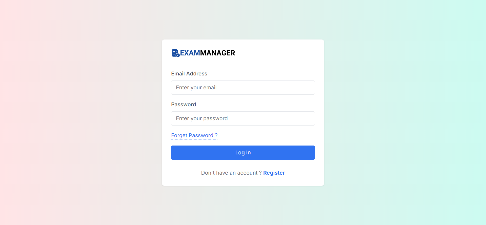
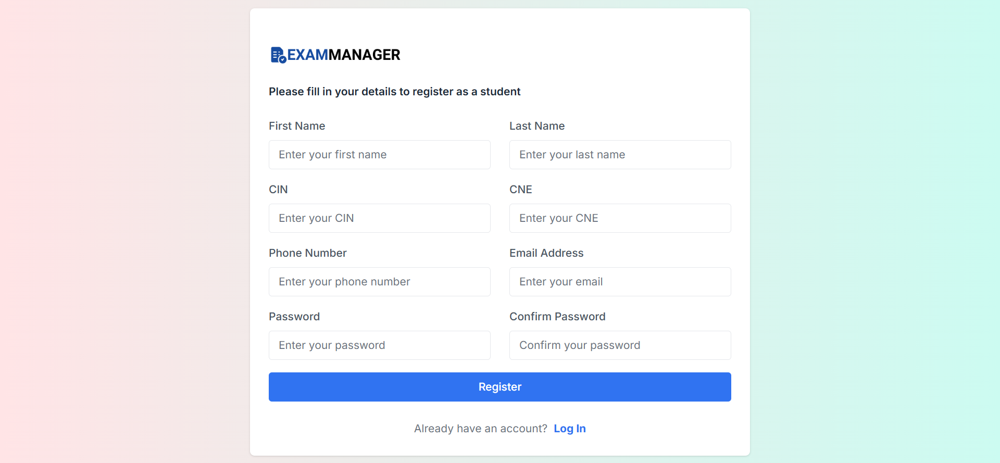
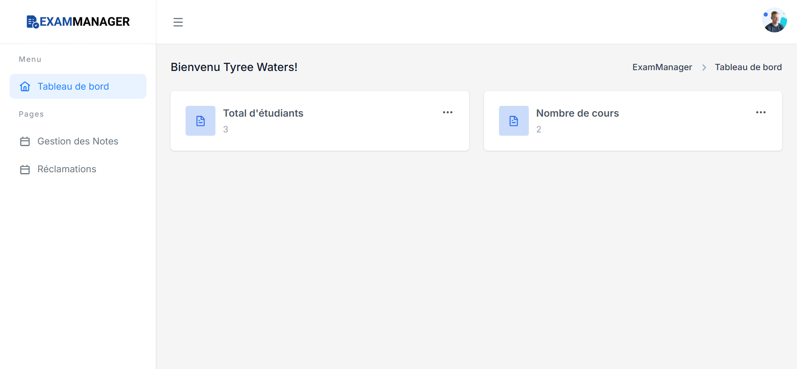
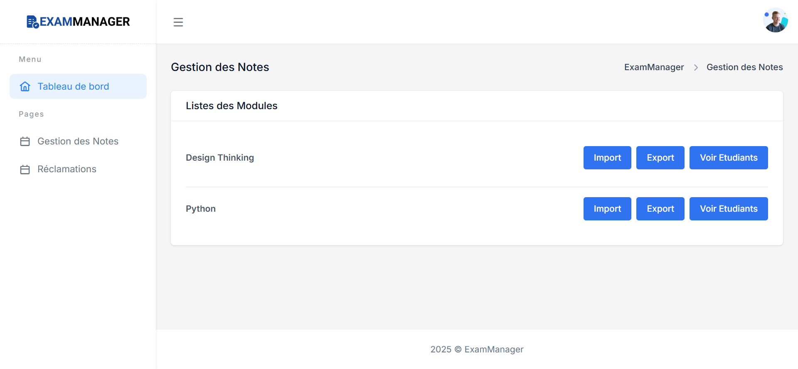
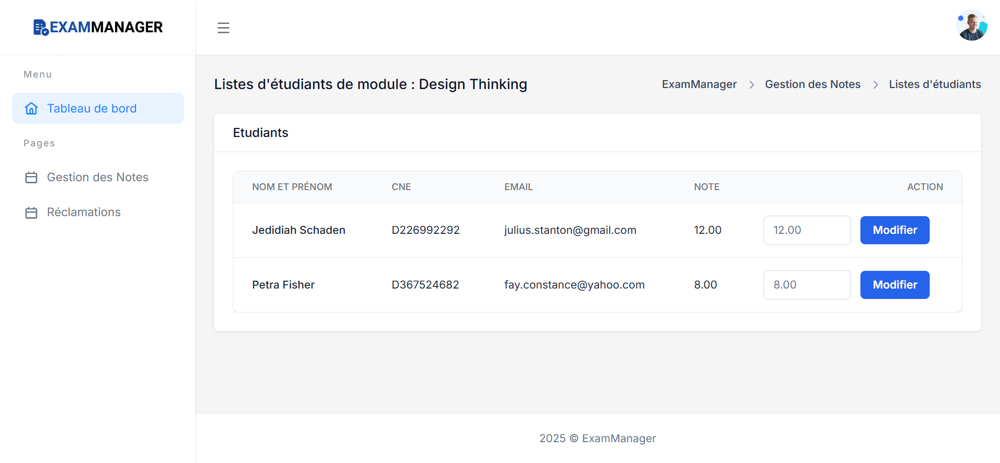
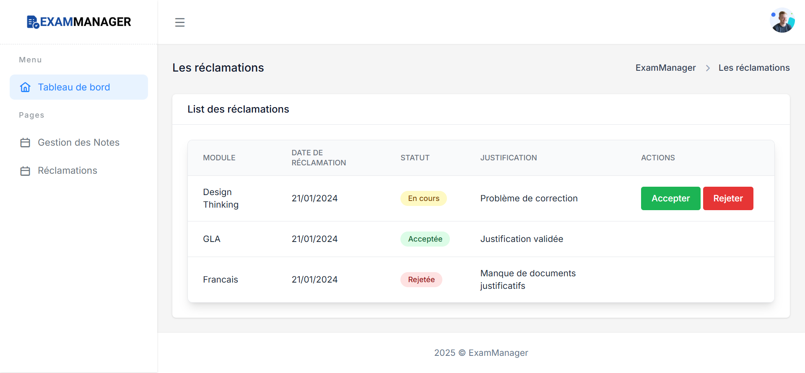
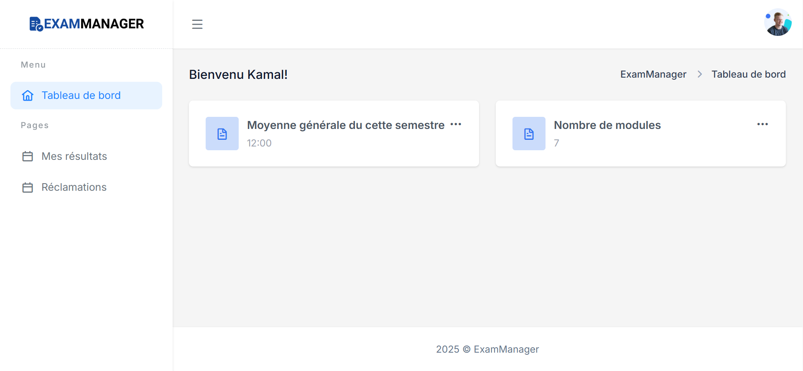
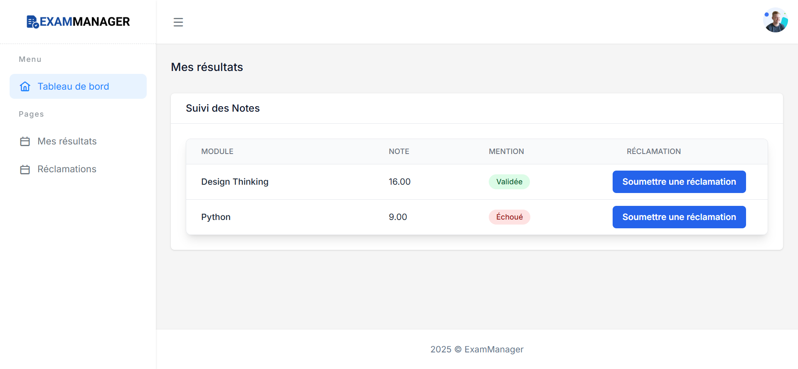
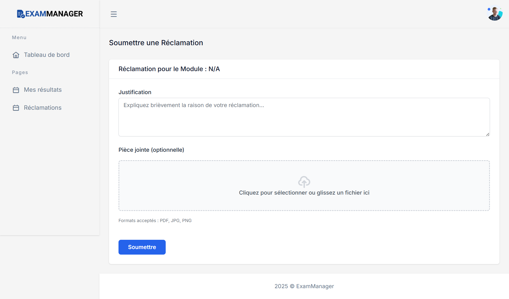

# ExamManager - Academic Grade Management System

ExamManager is a comprehensive academic grade management platform built with CodeIgniter 4 and modern web technologies. It features a clean, responsive design and enables efficient management of student grades, courses, and academic records for both professors and students.

## 🚀 Features

### For Students
- **Grade Viewing**: View grades for all enrolled courses
- **Course Enrollment**: Access to course-specific information
- **Reclamation System**: Submit grade reclamations and track their status
- **Dashboard**: Overview of academic performance and statistics
- **Profile Management**: Update personal information and account details

### For Professors
- **Dashboard**: Overview of courses and student statistics
- **Grade Management**: Create, update, and manage student grades
- **Course Management**: Manage course information and enrolled students
- **Reclamation Processing**: Review and respond to student reclamations
- **Student Overview**: View and manage student information
- **Excel Integration**: Import/export grades using Excel files


## 📸 Images of the Website

### Professor Interface

<table>
  <tr>
    <td align="center">
      
      <br><b>Login Page</b>
    </td>
    <td align="center">
      
      <br><b>Sign up Page</b>
    </td>
  </tr>
  <tr>
    <td align="center">
      
      <br><b>Professor Dashboard</b>
    </td>
    <td align="center">
      
      <br><b>Excel Import/Export Grades</b>
    </td>
  </tr>
  <tr>
    <td align="center">
      
      <br><b>Modify Grades</b>
    </td>
    <td align="center">
      
      <br><b>Reclamation Management</b>
    </td>
  </tr>
</table>

### Student Interface

<table>
  <tr>
    <td align="center">
      
      <br><b>Student Dashboard</b>
    </td>
    <td align="center">
      
      <br><b>View Grades</b>
    </td>
  </tr>
  <tr>
    <td align="center">
      
      <br><b>Submit Reclamation</b>
    </td>
  </tr>
</table>

## 🛠️ Technology Stack

- **Backend**: CodeIgniter 4, PHP 8.1+
- **Frontend**: HTML5, CSS3, JavaScript, Tailwind CSS
- **Database**: MySQL 8.0
- **Build Tools**: Composer, npm
- **Additional Libraries**: PHPSpreadsheet (Excel integration), PHPUnit (Testing)
- **Authentication**: Session-based authentication with role-based access control

## 📋 Prerequisites

- PHP 8.1 or higher
- MySQL 8.0 or higher
- Composer
- Node.js and npm (for Tailwind CSS)
- Web server (Apache/Nginx)

## ⚙️ Installation & Setup

### 1. Clone the Repository
```bash
git clone <repository-url>
cd ExamManager
```

### 2. Install Dependencies
```bash
# Install PHP dependencies
composer install

# Install Node.js dependencies for Tailwind CSS
npm install
```

### 3. Database Setup
Create a MySQL database:
```sql
CREATE DATABASE gestion_examens;
```

### 4. Environment Configuration
Copy the environment file:
```bash
cp env .env
```

Update the database configuration in `.env`:
```env
database.default.hostname = localhost
database.default.database = gestion_examens
database.default.username = your_mysql_username
database.default.password = your_mysql_password
database.default.DBDriver = MySQLi
database.default.port = 3306
```

### 5. Database Migration
Run the database migrations:
```bash
php spark migrate
```

### 6. Build CSS
Compile Tailwind CSS:
```bash
npm run build
```

### 7. Run the Application
Start the development server:
```bash
php spark serve
```

The application will be available at: `http://localhost:8080`

## 🔐 Default Credentials

### Professor Account
- **Email**: audra05@gmail.com
- **Password**: password

*Note: As for student you can create accounts through the registration system.*

## 📁 Project Structure

```
ExamManager/
├── app/
│   ├── Controllers/          # Application controllers
│   │   ├── CourseController.php
│   │   ├── ProfessorController.php
│   │   ├── StudentController.php
│   │   └── UserController.php
│   ├── Models/               # Database models
│   │   ├── CourseModel.php
│   │   ├── StudentModel.php
│   │   └── UserModel.php
│   ├── Views/                # View templates
│   │   ├── professor/        # Professor interface
│   │   ├── student/          # Student interface
│   │   └── admin/            # Admin interface
│   ├── Config/               # Configuration files
│   ├── Database/             # Migrations and seeds
│   ├── Filters/              # Authentication filters
│   ├── Enums/                # Enumeration classes
│   └── Helpers/              # Helper functions
├── public/                   # Web root directory
│   ├── assets/               # Static assets
│   └── index.php             # Entry point
├── writable/                 # Writable directories
├── tests/                    # Test files
├── vendor/                   # Composer dependencies
├── composer.json             # PHP dependencies
├── package.json              # Node.js dependencies
└── tailwind.config.js        # Tailwind CSS configuration
```

### Security Features
- Password hashing using PHP's `password_hash()`
- Session-based authentication
- Role-based route filtering
- CSRF protection
- Input validation and sanitization

## 🎨 UI/UX Features

- **Responsive Design**: Tailwind CSS-based responsive layout
- **Modern Interface**: Clean and professional design with consistent styling
- **Interactive Elements**: Dynamic forms with validation feedback
- **Dashboard Analytics**: Visual representation of academic data
- **Excel Integration**: Seamless import/export functionality for grade management
- **Modal-Based Operations**: Efficient workflow with popup modals
- **Role-Specific Interfaces**: Tailored user experience for different user types

---

**ExamManager - Academic Grade Management System**

*Built with CodeIgniter 4 for efficient academic administration*